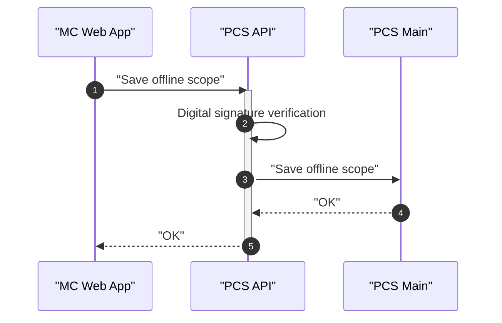
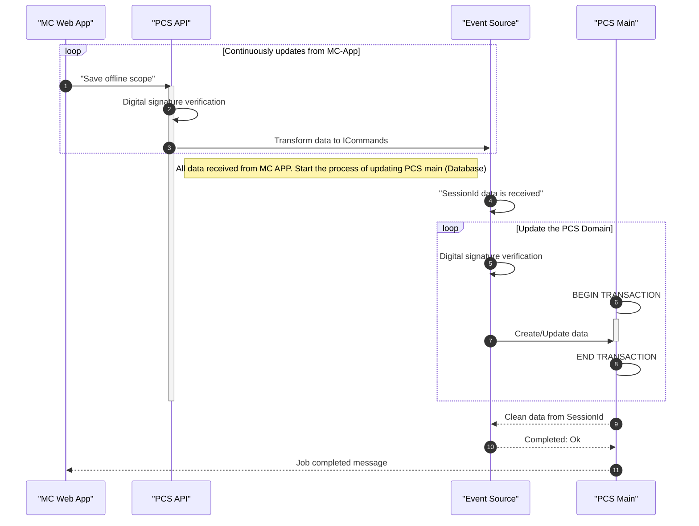

# MC App - User Stores (in addition) to what we have today

## Feature: As a search result I need  to be extended with a checkbox for each table row that adds the selected row to the offline scope
 
### User Story 1
As a user of mc-web-app I want to be able to select one or more McPkt given by the McPkt search result, 
 sso that the selected McPkt will be a part of offline-scope

#### Acceptance Criteria:
The result result will have an additional column with a checkbox, so that the user can select the McPkt to be part of offline-scope

#### Technical requirements:
[The flow between MC APP -> PCS API](#establishing-and-saving-an-offline-scope)


### User Story 2
As a user of mc-web-app I want to be able to select one or more WO given by the WO search result, 
 so that the selected WO will be a part of offline-scope

#### Acceptance Criteria:
The result result will have an additional column with a checkbox, so that the user can select the WO to be part of offline-scope
When a user click on a row the item will be present as active checkbox in the row. (Or something more user friendly UI component)

#### Technical requirements:
[The flow between MC APP -> PCS API](#establishing-and-saving-an-offline-scope)

### User Story 3
As a user of mc-web-app I want to be able to select one or more Tag given by the Tag search result,
 so that the selected Tag will be a part of offline-scope

Acceptance Criteria:
The result result will have an additional column with a checkbox, so that the user can select the Tag to be part of offline-scope

#### Technical requirements:
[The flow between MC APP -> PCS API](#establishing-and-saving-an-offline-scope)


### User Story 4
As a user of mc-web-app I want to be able to select one or more PO given by the PO search result,
 so that the selected PO will be a part of offline-scope

#### Acceptance Criteria:
The result result will have an additional column with a checkbox, so that the user can select the PO to be part of offline-scope

#### Technical requirements:
[The flow between MC APP -> PCS API](#establishing-and-saving-an-offline-scope)

## Feature - Saved search in PCS can be used to build a offline-scope 

### User Story 1
As a user of mc-web-app I want to use my mc-web-app search (especially created for the mc-web-app) for building offline-scope, so that the search defines either 1) total or a subset of offline-scope

### Acceptance Criteria
Executing the search will results in a list with Entities of types of (1) Tags, (2) WO, (3) PO, (3) CommPkt, (4) McPkt. The the Entities can be a entity that contains on or many checklists and Punch. The search will be the data source of a complete or partial offline-scope.


#### Technical requirements:
In the case of running a query for establishing the a offline scope (or a partial one) we use the same concept as for single operation,  but now as a batch operation. 
[The flow between MC APP -> PCS API](#establishing-and-saving-an-offline-scope)


# The process of creating and saving data to offline scope 
The PCS API will have to be modified to support and mechanism that ensure the data integrity. We suggest that we add a digital signature on every API response: 
The digital signature can be realized by adding a HEADER to the http request. 
{"PCS_MC_APP_Mode", "SYNC"}, 
{"PCS_MC_APP_KEY", "information_about_when_the_data_was_lasted_modified_}
The The KEY will provide created and modified values from when the offline scope was created

#### Custom HTTP Headers for controlling sync data flow

``` Http Headers
([MC_APP_MODE], [SYNC])
([MC_APP_LAST_KNOWN_KEY], [{date}}])
([API_BROKEN_DATA_INTEGRITY], [ID])
```  

Technical suggestion: Introduce a .NET middleware that are "triggered" by the headers.
1. Do something when a http request contains a special header
    1.1: Check if the Now(Entity.ModifiedDate) != HttpRequest.Headers[MC_APP_LAST_KNOWN_KEY] => data integrity is broken. Send a Http Response with header (API_BROKEN_DATA_INTEGRITY) with the Entity.ID to the staled data object.
         

### Intercept PCS MAIN API process and add a metadata to the response (ref)[#Custom Http Headers]
We can create a middleware that allow is to do 
1. Create a digital signature on the response 
2. Ensure data integrity. Validate a incoming requests that contains a HEADER with a just-in-time generated signature. [more details here](#technical-requirements)

#### Code for making a middleware 
``` C# 
public class DigitalSignatureMiddleware
{
    private readonly RequestDelegate _next;
    public CustomMiddleware(RequestDelegate next)
    {
        _next = next;            
    }

    public async Task Invoke(HttpContext context)
    {
        context.Response.OnStarting((state) =>
        {;
            var digitalSignature = CreateDigitalSignature(responseBody, responseParams);
            context.Response.Headers.Add("DigitalSignature", digitalSignature)            
            return Task.FromResult(0);
        }, null);

        await _next.Invoke(context);
    }
}
```

# Establishing and Saving an offline scope

## Establishing an offline scope

### Querying Main API - Building the offline scope
1. [As-Is] A http request will be sent to the Main API  
2. [As-Is] The main api will the query PCS Main for data  
3. [NEW] The main api will create a digital signature based on the http request and response. The response params or payload (content) will be supplied with the digital signature 
[more details](#intercept-pcs-main-api-process-and-add-a-metadata-to-the-response)

Note: The signature will be used as a safety mechanism to verify that the data is not touched by others when it have been allocated as part of a offline-scope.

4. The signature will be based on a suitable hashing algorithm.
5. [NEW] Mc-web-app receives the response 
6. [NEW] Store the information in browser database

<b>Note: </b>All the http requests for building up a offline scope is a result of an user action ()


## Saving the offline scope to PCS Main 

### With valid digital signature 

### With invalid digital signature - The PCS API will validate and act with an error response back to MC-Web-app


 ```mermaid 
sequenceDiagram
autonumber
participant MC as "MC Web App"
participant API as "PCS API"
participant MA as "PCS Main"

MC ->> API : "Save offline scope"
activate API
API ->> API : Digital signature verification
API -->> MC : "Digital signature verification failed"
deactivate API
```

### Persist offline data - Saving the offline scope back to PCS Server
1. The MC-web-app will be set to online mode
2. The MC-web-app will start sending created and modified data to PCS API 
3. [NEW] The PCS API will retrieve data according to the established data contract, but for put|patch|post|delete requests will the digital signature be a part of the request)
4. [NEW] The PCS API will verify the digital signature with a new signature calculated on as is data in the database. 

[more details](#intercept-pcs-main-api-process-and-add-a-metadata-to-the-response)

#### Verifying the digital signatures 
<I>The signature (Old signature) located in the incoming request will be compared with a just-in_time signature (New signature)) </I>
``` if 
    New signature == Old signature. the data will be persisted to the PCS server
    New signature != Old signature, the data will not be persisted to the PCS server
```

<i> Note: Remember to add into the technical requirements to be able to write a correct date and time when the Entity was created or modified </i>

## Question - Is it important to know when an entity is created, modified or deleted in real time? Or should the time be set to when the API retrieves the data in a save offline scope operation.

?????

# Transmission of data from MC-App to PCS Maintenance
Data communication between handheld device in area with potential bad WIFI conditions can in be a problem. 
# Scenario 1 - [AS-IS] PCS MAIN will continuously be updated by the incoming data   
- When a user loose his WIFI connection in the middle upload
- Transmission is been terminated by intension

## If the scenario is real and we need to find a solution:  

1. Event Source between PCS API and PCS MAIN where we store all incoming events (event is here a ICommand with create or modification intention) 
2. The MC App will give metadata on percentage done and a session id (SessionId for an offline-scope)
(E.g. SessionId: "offline-scope-1" and percentage done: "50" in the request headers)
3. When the Event Source have reviewed all data related to a sessionId. The Event Source will in chronology order start sending the commands to PCS Main

<B>Note:<BR><BR></B> 
If the Event Source accepts waiting to long for an operation to fullfil, we might risks to update the system with stale data. 
<BR>
<BR>
(The digital signature validation process have validated the data, but now after a long time "sleep" in the Event Source the validation is not valid anymore))).
<BR>
<BR> 
A solution onto this challenge is to run the digital signature validation right before sending the event to PCS Main.
If all event (Commands) are valid, we can establish a database transaction, do the updates and commit transactions when Event Source completes successfully.


### Optimistic approach - PCS MAIN will be continuously updated by the incoming data

The purpose with the illustration below is to visualize a interrupted upload of a offline-scope. There are always a risk of loosing data connection between the MC-App and PCS MAIN, especially in environments where WIFI is a limited resource.    


### Sequence diagram where the MC-App is interrupted due to eg. a WIFI loss
 ```mermaid 
sequenceDiagram
autonumber
participant MC as "MC Web App"
participant API as "PCS API"
participant MA as "PCS Main"
MC ->> API : "Save offline scope"
activate API
API ->> API : Digital signature verification
API ->> MA: Create/Update data 
API -->> MC : "Digital signature verification OK"
API ->> API : Digital signature verification
API ->> MA: Create/Update data 
API -->> MC : "Digital signature verification OK"
API ->> API : Digital signature verification
API ->> MA: Create/Update data 
API -->> MC : "Digital signature verification OK"
Note right of API: The communication stops due to unknown reasons
deactivate API
```
### Sequence diagram where the Event Source control the data flow 
PCS MAIN will start receiving updates when the Event Source have have received all the relevant data associated to a known sessionId.
