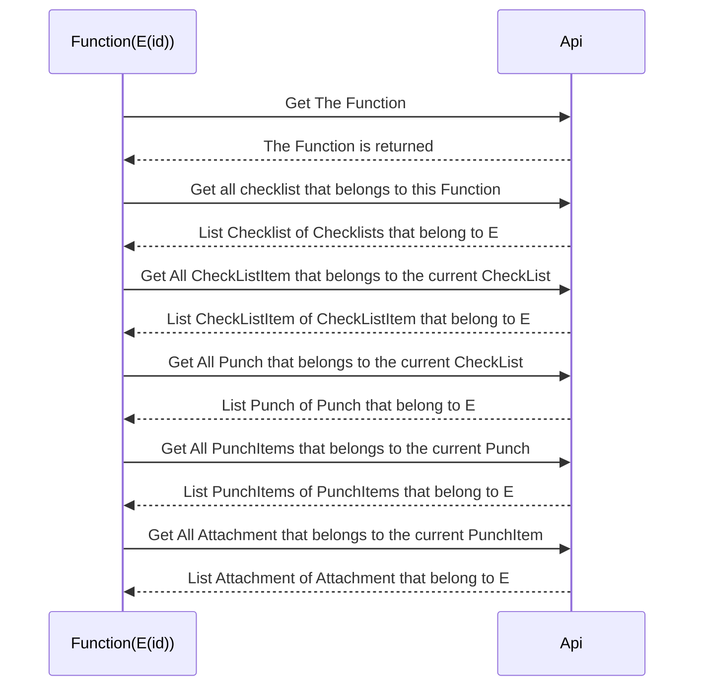
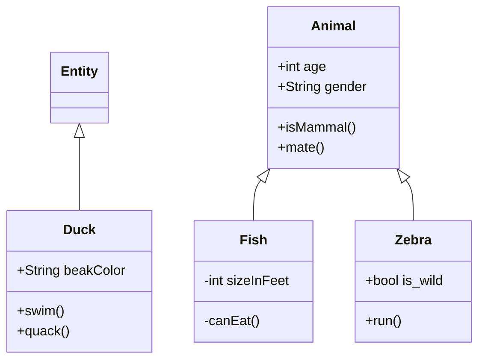

# Building offlone scope 

## Visitor pattern matchingBenefits:
The following lists the benefits of using the Visitor pattern:

1. Makes adding new operations easy
2. Gathers related operations and separates unrelated ones

When to Use:
You should use the Visitor pattern when:

1. An object structure contains many classes of objects with differing interfaces and you want to perform operations on these objects that depend on their concrete classes.
2. Classes defining the object structure rarely change but you often want to define new operations over the structure.

## Offline
