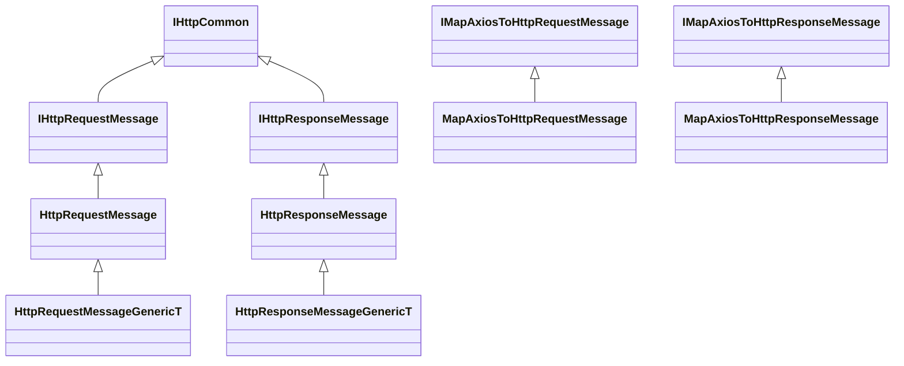
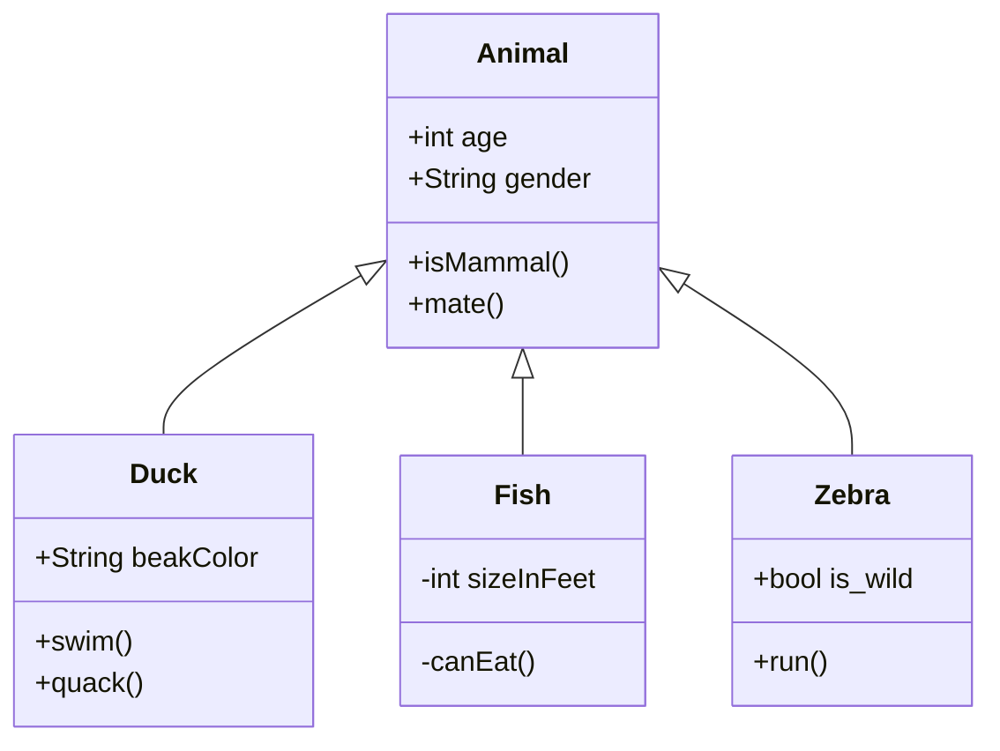

# Axios HttpClient 
Http communication is implemented with the Axios library. The HttpRequests and Responses for offline content will be defined by two simple classes 
    - HttpRequestMessage 
    - HttpResponseMessage

The objects will have the same design as there counterpart in .net Core. The classes will put common functionality to to the base classes and share a common abstract interface. The main reason for creating these classes is to be agnostics to technology stack. And delegate the Axios -> Data and Data -> Axios into the base functionality.

